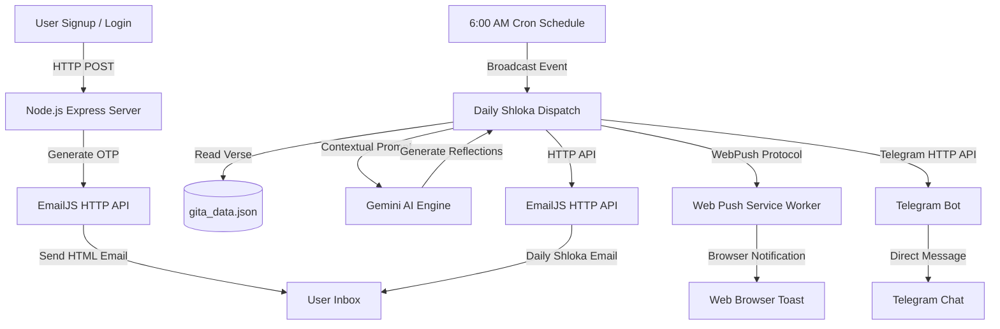

# 🪔 GitaDaily — Daily Bhagavad Gita Wisdom & AI Reflections

> *"Perform your duty equipoised, O Arjuna, abandoning all attachment to success or failure. Such equanimity is called Yoga."* — **Bhagavad Gita (2.48)**


**GitaDaily** is a modern, high-polish spiritual companion application designed to cultivate daily discipline, mental clarity, and focus. In a fast-paced world filled with distractions, GitaDaily serves as your morning anchor, delivering a daily sacred verse from the Bhagavad Gita alongside advanced AI reflections directly to your inbox, web browser, and messaging channels at exactly **6:00 AM local time**.

---

## 🌅 The Power of Daily Discipline (Sadhana)

Spiritual growth and mental fortitude do not happen by chance; they are forged through consistent, daily discipline (*Sadhana*). GitaDaily is designed with a strict disciplinary structure:
* **The 6:00 AM Commitment**: Every morning, before your workday begins, you are greeted with a sacred shloka. This forces a moment of silence, reflection, and setting high intentions before the chaos of the day takes over.
* **No Delays, No Dev Modes**: Authentication is secured through real email OTP delivery. Access is earned through presence, ensuring your spiritual dashboard is a focused sanctuary.
* **Modern Integration**: The teachings are not kept abstract. Our AI model contextualizes the shlokas specifically for modern-day work pressures, emotional health, and focused action, turning ancient wisdom into a daily system of rules for life.

---

## 🛠️ System Architecture & Data Flow

GitaDaily operates on a secure, serverless-ready multi-channel architecture:



1. **User Authentication**: Secure, passwordless entry using EmailJS HTTP API to dispatch OTPs over TLS, preventing any SMTP port blocks on hosting environments like Render's free tier.
2. **AI Reflection Engine**: Generates real-time localized analyses targeting:
   - **Modern Relevance**: Translating cosmic truths into advice for relationships, technology, and contemporary life.
   - **Emotional Well-being**: Guidelines for handling anxiety, stress, and preserving mental peace.
   - **Career & Focus**: Actionable advice on professional duties, execution, leadership, and detachment from results (*Nishkama Karma*).
3. **Multi-Channel Dispatcher**: Simultaneously broadcasts the verse, transliteration, and AI reflections to all active channels.

---

## 📸 Sacred Visuals

The application pairs every daily verse with high-quality, inspiring devotional artwork reflecting core moments from the Mahabharata:

| Chariot & Discourse | Vishwaroopa |
| :---: | :---: |
|  |  |
| *Guidance on the battlefield of duty.* | *The grand revelation of the cosmic order.* |

---

## 💻 Tech Stack

* **Frontend**: React, TypeScript, Vite, Vanilla CSS (harmonious dark mode, glassmorphic cards, micro-animations, and background watermarks).
* **Backend**: Node.js, Express.js.
* **Email Delivery**: EmailJS API (HTTP port 443).
* **AI Reflections**: Google Gemini AI.
* **Web Push**: VAPID & Web Push Protocol Service Workers.
* **Telegram Service**: Node Telegram Polling (Dynamic status notice blocks when restricted).

---

## ⚙️ Local Configuration & Deployment

### 1. Environment Variables (`/backend/.env`)
Create a `.env` file in the backend directory containing:
```env
PORT=5005
GEMINI_API_KEY=your_gemini_api_key

# Web Push Keys
VAPID_PUBLIC_KEY=your_vapid_public_key
VAPID_PRIVATE_KEY=your_vapid_private_key

# EmailJS Configuration (Bypasses Render SMTP port blocking)
EMAILJS_SERVICE_ID=your_service_id
EMAILJS_PUBLIC_KEY=your_public_key
EMAILJS_PRIVATE_KEY=your_private_key_access_token
EMAILJS_OTP_TEMPLATE_ID=your_otp_template_id
EMAILJS_SHLOKA_TEMPLATE_ID=your_shloka_template_id
```

### 2. Run the Application Locally
Launch both servers simultaneously:

**Backend**:
```bash
cd backend
npm install
npm run dev
```

**Frontend**:
```bash
cd frontend
npm install
npm run dev
```

### 3. Production Deployment Notes
* **Frontend**: Deployed on **Vercel** with the `VITE_API_BASE_URL` env variable pointing to your backend `/api` endpoint.
* **Backend**: Deployed on **Render** (Free Tier).
* **Daily Cron Wakeup**: Set up a free daily cron rule on **[Cron-Job.org](https://cron-job.org)** targeting `https://your-backend.onrender.com/api/trigger-daily-broadcast` at **6:00 AM** to wake up the Render instance and execute the broadcast.

---

> *"Arise, O Arjuna! Conquer your mind, align your action with duty, and establish your daily discipline."* 🪔
