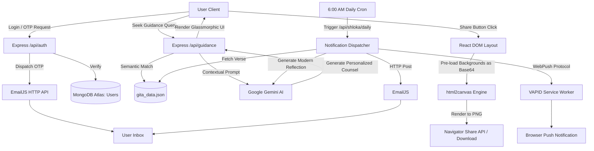

# 🦚 Krishna Bodha — Daily Bhagavad Gita Wisdom & Seek Divine Guidance

> *"Perform your duty equipoised, O Arjuna, abandoning all attachment to success or failure. Such equanimity is called Yoga."* — **Bhagavad Gita (2.48)**


**Krishna Bodha** is a modern, high-polish spiritual companion application designed to cultivate daily discipline, mental clarity, and focus. In a fast-paced world filled with distractions, Krishna Bodha serves as your morning anchor, delivering a daily sacred verse from the Bhagavad Gita alongside advanced AI reflections directly to your inbox and web browser at exactly **6:00 AM local time**.

Our flagship **Seek Divine Guidance** module allows users to type any life challenge, doubt, or emotional state and receive direct, personalized AI counsel matching their query to the perfect shloka from the Gita—proving that the Bhagavad Gita has solutions to every problem, big or small.

---

## ✨ Features & Modules

### 1. Flagship Feature: Seek Divine Guidance (Reflect by Mood)
The Gita has solutions to every human challenge. The **Seek Guidance** module brings this wisdom to life interactively:
* **Describe Your Situation**: Users type their current struggle, query, or feeling (e.g., *"I feel burnt out at work"* or *"I am struggling to control my anger"*).
* **AI Analysis & Verse Matching**: The server queries the local index of verses and directs **Google Gemini AI** to select the single most relevant shloka that answers their query.
* **Personalized Counsel**: Gemini generates a custom-tailored counseling response in the user's selected language (English, Hindi, Telugu, or Kannada), linking the shloka's wisdom to their exact problem.
* **Actionable Step**: Provides a single, clear action step for the user to practice immediately.

### 2. The Power of Daily Discipline (Sadhana)
* **The 6:00 AM Commitment**: Every morning, before your workday begins, you are greeted with a sacred shloka. This forces a moment of silence, reflection, and setting high intentions before the chaos of the day takes over.
* **Modern Integration**: The teachings are not kept abstract. Our AI model contextualizes the shlokas specifically for modern-day work pressures, emotional health, and focused action.

### 3. Native Social Sharing (Cross-Platform)
Users can generate **beautiful, high-resolution shareable images** of their daily shloka or personalized guidance:
* **Rich Typography**: Features custom-loaded Sanskrit typography, transliterations, and native rendering for Indic scripts like Telugu and Kannada.
* **Premium Design**: Generates a dynamic 1080x1350 canvas featuring double-layered gold borders with diamond accents, custom gradients, and thematic backgrounds.
* **Bulletproof Engine**: Powered by `html2canvas` and Base64 image pre-loading to perfectly capture complex CSS flexbox layouts and native text shaping, ensuring flawless exports across Desktop, Android, and iOS Safari.

### 4. Immersive Audio Experience
* **Divine Bansuri Player**: Features a floating glassmorphic player capsule at the bottom-right corner playing whisper-soft classical bansuri (flute) melodies at a gentle volume.
* Tracks include *Playful Krishna* (Carnatic flute by Dr. N. Ramani) and *Vrindavan Meditations* (Hindustani classical bansuri by Pt. Hariprasad Chaurasia).

---

## 🛠️ System Architecture & Data Flow

Krishna Bodha operates on a secure, multi-channel architecture leveraging both local caching and cloud databases:



### Key Architectural Decisions:
1. **Hybrid Database Model**: Immutable Bhagavad Gita verses are stored locally in `gita_data.json` for zero-latency retrieval, while dynamic user state (profiles, bookmarks, history) is stored securely in **MongoDB Atlas**.
2. **AI Guidance Engine**: Uses `gemini-3.5-flash` to analyze user queries. To optimize API costs, daily reflections are generated once per language and cached locally in `reflections.json`.
3. **Cross-Platform Sharing Engine**: Bypasses `html-to-image` CORS and SVG `foreignObject` limitations on mobile Safari by using a hybrid React DOM + `html2canvas` pipeline with Base64 asset pre-fetching.

---

## 💻 Tech Stack

* **Frontend**: React, TypeScript, Vite, Vanilla CSS (Glassmorphism, Custom CSS Variables).
* **Backend**: Node.js, Express.js.
* **Database**: MongoDB Atlas (Mongoose ODM).
* **AI Engine**: Google Gemini AI (`gemini-3.5-flash`).
* **Canvas Export**: `html2canvas`.
* **Email Delivery**: EmailJS API.
* **Web Push**: VAPID & Web Push Protocol Service Workers.

---

## ⚙️ Local Configuration & Deployment

### 1. Environment Variables (`/backend/.env`)
Create a `.env` file in the backend directory containing:
```env
PORT=5000
MONGODB_URI=your_mongodb_connection_string
GEMINI_API_KEY=your_gemini_api_key

# Web Push Keys
VAPID_PUBLIC_KEY=your_vapid_public_key
VAPID_PRIVATE_KEY=your_vapid_private_key

# EmailJS Configuration
EMAILJS_SERVICE_ID=your_service_id
EMAILJS_PUBLIC_KEY=your_public_key
EMAILJS_PRIVATE_KEY=your_private_key
EMAILJS_OTP_TEMPLATE_ID=your_otp_template_id
EMAILJS_SHLOKA_TEMPLATE_ID=your_shloka_template_id
```

### 2. Run the Application Locally
Launch both servers simultaneously:

**Backend**:
```bash
cd backend
npm install
npm run dev
```

**Frontend**:
```bash
cd frontend
npm install
npm run dev
```

### 3. Production Deployment Notes
* **Frontend**: Deployed on **Vercel** with the `VITE_API_BASE_URL` env variable pointing to your backend `/api` endpoint.
* **Backend**: Deployed on **Render**.
* **Database**: Hosted on **MongoDB Atlas**.
* **Daily Cron Wakeup**: Set up a free daily cron rule on **[Cron-Job.org](https://cron-job.org)** targeting `/api/shloka/daily` at **6:00 AM** to wake up the Render instance and execute the broadcast.

---

> *"Arise, O Arjuna! Conquer your mind, align your action with duty, and establish your daily discipline."* 🦚
